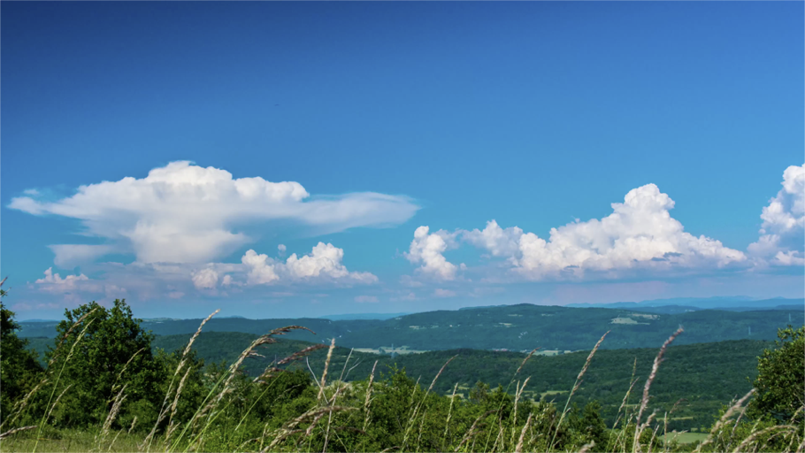

# GENESIS Project

> The GENESIS project aims to make a systematic study of boundary layer
heterogeneity and its interaction with moist convection based on analysis of
Large-Eddy Simulations. This will provide measures of the scales of interaction
relevant to triggering and maintaining convection which are traditionally
unresolved in global circulation models. The project focusses on observed
physical phenomena (shallow/deep convection, aggregated convection and
coldpools) and how these interact with and influence structures in the boundary
layer. The aim is to provide existing and new convection schemes with
a statistical description of the forcing from below cloud base and through this
aid the development of convection schemes with better representation of
sub-grid variability.

GENESIS was funded as part of the UK-wide five-year joint Met Office and NERC
[ParaCon project](https://www.metoffice.gov.uk/research/collaboration/paracon)

[Leeds university GENESIS project
website](https://fluids.leeds.ac.uk/research/genesis-triggering-of-convection-paracon-programme/)

## Project members

-  Cathryn    Birch      <c.e.birch02@leeds.ac.uk>
-  Alan       Blyth      <a.m.blyth@leeds.ac.uk>
-  Steven     Boeing     <s.boeing@leeds.ac.uk>
-  Leif       Denby (Lead PDRA) <l.c.denby@leeds.ac.uk>
-  Stephen    Griffiths  <sdg@maths.leeds.ac.uk>
-  Francoise  Guichard   <francoise.guichard@meteo.fr>
-  Richard    Keane      <r.j.keane@leeds.ac.uk>
-  John       Marsham    <j.marsham@leeds.ac.uk>
-  Doug       Parker (PI) <d.j.parker@leeds.ac.uk>
-  Andrew     Ross       <a.n.ross@leeds.ac.uk>
-  Steve      Tobias     <s.m.tobias@leeds.ac.uk>
-  Adrian     Tompkins   <tompkins@ictp.it>
